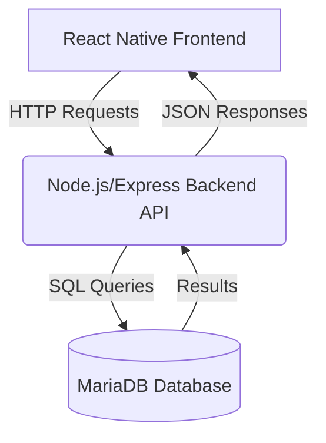

# Αναφορά Υλοποίησης Εφαρμογής Κρατήσεων Εστιατορίων

## 1. Εισαγωγή

Η παρούσα εργασία αφορά την ανάπτυξη μιας ολοκληρωμένης εφαρμογής για κινητά τηλέφωνα που επιτρέπει στους χρήστες να πραγματοποιούν κρατήσεις τραπεζιών σε εστιατόρια. Στόχος είναι η δημιουργία ενός κατανεμημένου συστήματος που συνδυάζει τεχνολογίες frontend (React Native), backend (Node.js/Express) και βάσης δεδομένων (MariaDB).

Η εφαρμογή επιτρέπει στους χρήστες να εγγραφούν, να συνδεθούν, να περιηγηθούν σε διαθέσιμα εστιατόρια, να πραγματοποιήσουν κρατήσεις και να διαχειριστούν το ιστορικό των κρατήσεών τους.

## 2. Αρχιτεκτονική Συστήματος

Η αρχιτεκτονική της εφαρμογής ακολουθεί ένα τυπικό μοντέλο Client-Server:

*   **Frontend (Client):** Μια εφαρμογή React Native για κινητά (Android/iOS) που παρέχει το περιβάλλον χρήστη (UI/UX) και αλληλεπιδρά με το backend μέσω HTTP αιτημάτων (REST API).
*   **Backend (Server):** Ένας Node.js server που χρησιμοποιεί το Express framework για τη δημιουργία ενός REST API. Είναι υπεύθυνος για την επιχειρηματική λογική, την αυθεντικοποίηση χρηστών και την επικοινωνία με τη βάση δεδομένων.
*   **Database:** Μια σχεσιακή βάση δεδομένων MariaDB που αποθηκεύει τα δεδομένα της εφαρμογής (χρήστες, εστιατόρια, κρατήσεις).



## 3. Backend (Node.js & Express)

Το backend υλοποιήθηκε με Node.js και το framework Express. Ακολουθείται μια δομή διαχωρισμού αρμοδιοτήτων (separation of concerns) με φακέλους για:
*   `config`: Ρυθμίσεις (π.χ., σύνδεση βάσης δεδομένων `db.js`).
*   `routes`: Ορισμός των διαδρομών του API (`auth.routes.js`, `restaurant.routes.js`, `reservation.routes.js`).
*   `controllers`: Η λογική επεξεργασίας των αιτημάτων για κάθε διαδρομή (`auth.controller.js`, `restaurant.controller.js`, `reservation.controller.js`).
*   `middleware`: Ενδιάμεση λογική, όπως ο έλεγχος αυθεντικοποίησης (`auth.middleware.js`).

### 3.1 Middleware

*   **JWT Authentication (`middleware/auth.middleware.js`):**
    *   Αυτό το middleware χρησιμοποιείται για την προστασία συγκεκριμένων διαδρομών του API.
    *   Ελέγχει την ύπαρξη και την εγκυρότητα ενός JSON Web Token (JWT) στην κεφαλίδα `Authorization` του αιτήματος (με μορφή `Bearer <token>`).
    *   Χρησιμοποιεί το `JWT_SECRET` από το αρχείο `.env` για την επαλήθευση της υπογραφής του token.
    *   Αν το token είναι έγκυρο, αποκωδικοποιεί το payload (που περιέχει πληροφορίες χρήστη, π.χ., `user_id`) και το επισυνάπτει στο αντικείμενο `req` (`req.user`), επιτρέποντας την πρόσβαση στην προστατευμένη διαδρομή.
    *   Σε περίπτωση μη έγκυρου ή ανύπαρκτου token, επιστρέφει σφάλμα `401 Unauthorized`.

### 3.2 REST API Endpoints

Παρακάτω περιγράφονται τα βασικά endpoints του API που υλοποιήθηκαν:

**Α. Authentication Routes (`routes/auth.routes.js`)**

1.  **Εγγραφή Χρήστη**
    *   **Method:** `POST`
    *   **Path:** `/api/auth/register`
    *   **Purpose:** Δημιουργία νέου λογαριασμού χρήστη.
    *   **Authentication:** Όχι
    *   **Request Body (JSON):**
        ```json
        {
          "name": "string",
          "email": "string (valid email format)",
          "password": "string (min length recommended)"
        }
        ```
    *   **Success Response (201 Created):**
        ```json
        {
          "message": "User registered successfully.",
          "userId": number 
        }
        ```
    *   **Error Responses:**
        *   `400 Bad Request`: Missing fields, invalid email/password format.
        *   `409 Conflict`: Email already exists.
        *   `500 Internal Server Error`: Database or other server error.

2.  **Σύνδεση Χρήστη**
    *   **Method:** `POST`
    *   **Path:** `/api/auth/login`
    *   **Purpose:** Αυθεντικοποίηση χρήστη και επιστροφή JWT token.
    *   **Authentication:** Όχι
    *   **Request Body (JSON):**
        ```json
        {
          "email": "string",
          "password": "string"
        }
        ```
    *   **Success Response (200 OK):**
        ```json
        {
          "token": "string (JWT token)"
        }
        ```
    *   **Error Responses:**
        *   `400 Bad Request`: Missing fields.
        *   `401 Unauthorized`: Invalid credentials.
        *   `500 Internal Server Error`: Server error during login/token generation.

**Β. Restaurant Routes (`routes/restaurant.routes.js`)**

1.  **Λήψη Λίστας Εστιατορίων**
    *   **Method:** `GET`
    *   **Path:** `/api/restaurants`
    *   **Purpose:** Επιστροφή λίστας όλων των διαθέσιμων εστιατορίων.
    *   **Authentication:** Όχι (προς το παρόν)
    *   **Request Body:** N/A
    *   **Query Parameters (Future):** `?name=...`, `?location=...` για αναζήτηση.
    *   **Success Response (200 OK):**
        ```json
        [
          {
            "restaurant_id": number,
            "name": "string",
            "location": "string",
            "description": "string or null"
          },
          // ... more restaurants
        ]
        ```
    *   **Error Responses:**
        *   `500 Internal Server Error`: Database error.

**Γ. Reservation Routes (`routes/reservation.routes.js`)**

1.  **Δημιουργία Κράτησης**
    *   **Method:** `POST`
    *   **Path:** `/api/reservations`
    *   **Purpose:** Καταχώρηση νέας κράτησης για τον συνδεδεμένο χρήστη.
    *   **Authentication:** Ναι (JWT required)
    *   **Request Body (JSON):**
        ```json
        {
          "restaurant_id": number,
          "reservation_date": "string (YYYY-MM-DD)",
          "reservation_time": "string (HH:MM or HH:MM:SS)",
          "people_count": number (positive integer)
        }
        ```
    *   **Success Response (201 Created):**
        ```json
        {
          "message": "Reservation created successfully.",
          "reservationId": number
        }
        ```
    *   **Error Responses:**
        *   `400 Bad Request`: Missing fields, invalid data format.
        *   `401 Unauthorized`: Missing or invalid JWT.
        *   `404 Not Found`: Restaurant not found.
        *   `500 Internal Server Error`: Database error.

2.  **Λήψη Κρατήσεων Χρήστη**
    *   **Method:** `GET`
    *   **Path:** `/api/reservations/my`
    *   **Purpose:** Επιστροφή λίστας κρατήσεων για τον τρέχοντα συνδεδεμένο χρήστη.
    *   **Authentication:** Ναι (JWT required)
    *   **Request Body:** N/A
    *   **Success Response (200 OK):**
        ```json
        [
          {
            "reservation_id": number,
            "reservation_date": "string (YYYY-MM-DD)",
            "reservation_time": "string (HH:MM:SS)",
            "people_count": number,
            "created_at": "string (timestamp)",
            "restaurant_id": number,
            "restaurant_name": "string",
            "restaurant_location": "string"
          },
          // ... more reservations
        ]
        ```
    *   **Error Responses:**
        *   `401 Unauthorized`: Missing or invalid JWT.
        *   `500 Internal Server Error`: Database error.

3.  **Ενημέρωση Κράτησης**
    *   **Method:** `PUT`
    *   **Path:** `/api/reservations/:id` (όπου `:id` το ID της κράτησης)
    *   **Purpose:** Τροποποίηση μιας υπάρχουσας κράτησης από τον χρήστη που την έκανε.
    *   **Authentication:** Ναι (JWT required)
    *   **Request Body (JSON):** (Πρέπει να περιέχει τουλάχιστον ένα από τα παρακάτω πεδία)
        ```json
        {
          "reservation_date": "string (YYYY-MM-DD)",
          "reservation_time": "string (HH:MM or HH:MM:SS)",
          "people_count": number (positive integer)
        }
        ```
    *   **Success Response (200 OK):**
        ```json
        {
          "message": "Reservation updated successfully."
        }
        ```
    *   **Error Responses:**
        *   `400 Bad Request`: Missing fields, invalid data format.
        *   `401 Unauthorized`: Missing or invalid JWT.
        *   `403 Forbidden`: User does not own the reservation.
        *   `404 Not Found`: Reservation not found.
        *   `500 Internal Server Error`: Database error.

4.  **Διαγραφή Κράτησης**
    *   **Method:** `DELETE`
    *   **Path:** `/api/reservations/:id` (όπου `:id` το ID της κράτησης)
    *   **Purpose:** Διαγραφή μιας υπάρχουσας κράτησης από τον χρήστη που την έκανε.
    *   **Authentication:** Ναι (JWT required)
    *   **Request Body:** N/A
    *   **Success Response (200 OK):**
        ```json
        {
          "message": "Reservation deleted successfully."
        }
        ```
    *   **Error Responses:**
        *   `401 Unauthorized`: Missing or invalid JWT.
        *   `403 Forbidden`: User does not own the reservation.
        *   `404 Not Found`: Reservation not found.
        *   `500 Internal Server Error`: Database error.

## 4. Database (MariaDB)

Η βάση δεδομένων υλοποιήθηκε σε MariaDB. Η αρχική δομή (schema) δημιουργήθηκε με το παρακάτω SQL script:

```sql
-- Σημείωση: Το αρχικό script περιείχε εντολές CREATE DATABASE/USE.
-- Αυτές παραλείπονται εδώ καθώς η βάση (`mydatabase`) και ο χρήστης (`myuser`)
-- δημιουργήθηκαν μέσω παραμέτρων κατά την εκκίνηση του Docker container.

-- Create the Users table
CREATE TABLE IF NOT EXISTS users (
    user_id INT AUTO_INCREMENT PRIMARY KEY,
    name VARCHAR(255) NOT NULL,
    email VARCHAR(255) NOT NULL UNIQUE,
    password VARCHAR(255) NOT NULL, -- Store hashed passwords, not plain text!
    created_at TIMESTAMP DEFAULT CURRENT_TIMESTAMP
);

-- Create the Restaurants table
CREATE TABLE IF NOT EXISTS restaurants (
    restaurant_id INT AUTO_INCREMENT PRIMARY KEY,
    name VARCHAR(255) NOT NULL,
    location VARCHAR(255) NOT NULL,
    description TEXT,
    created_at TIMESTAMP DEFAULT CURRENT_TIMESTAMP
);

-- Create the Reservations table
CREATE TABLE IF NOT EXISTS reservations (
    reservation_id INT AUTO_INCREMENT PRIMARY KEY,
    user_id INT NOT NULL,
    restaurant_id INT NOT NULL,
    reservation_date DATE NOT NULL,
    reservation_time TIME NOT NULL,
    people_count INT NOT NULL,
    created_at TIMESTAMP DEFAULT CURRENT_TIMESTAMP,
    updated_at TIMESTAMP DEFAULT CURRENT_TIMESTAMP ON UPDATE CURRENT_TIMESTAMP,
    FOREIGN KEY (user_id) REFERENCES users(user_id) ON DELETE CASCADE,
    FOREIGN KEY (restaurant_id) REFERENCES restaurants(restaurant_id) ON DELETE CASCADE
    -- Optional: Add a unique constraint to prevent double booking for the same user/time/restaurant
    -- UNIQUE KEY unique_reservation (user_id, restaurant_id, reservation_date, reservation_time)
);

-- Optional: Add indexes for performance
ALTER TABLE users ADD INDEX idx_email (email);
ALTER TABLE restaurants ADD INDEX idx_name (name);
ALTER TABLE restaurants ADD INDEX idx_location (location);
ALTER TABLE reservations ADD INDEX idx_user_reservations (user_id, reservation_date);
ALTER TABLE reservations ADD INDEX idx_restaurant_reservations (restaurant_id, reservation_date);
```

**Περιγραφή Πινάκων:**

*   **`users`**: Αποθηκεύει πληροφορίες για τους χρήστες της εφαρμογής.
    *   `user_id`: Μοναδικό αναγνωριστικό χρήστη (Primary Key).
    *   `name`: Όνομα χρήστη.
    *   `email`: Διεύθυνση email (μοναδική), χρησιμοποιείται για τη σύνδεση.
    *   `password`: Κρυπτογραφημένος κωδικός πρόσβασης (χρησιμοποιείται bcrypt).
    *   `created_at`: Χρονοσφραγίδα δημιουργίας.
*   **`restaurants`**: Αποθηκεύει πληροφορίες για τα διαθέσιμα εστιατόρια.
    *   `restaurant_id`: Μοναδικό αναγνωριστικό εστιατορίου (Primary Key).
    *   `name`: Όνομα εστιατορίου.
    *   `location`: Τοποθεσία εστιατορίου.
    *   `description`: Περιγραφή του εστιατορίου.
    *   `created_at`: Χρονοσφραγίδα δημιουργίας.
*   **`reservations`**: Αποθηκεύει τις κρατήσεις που έχουν γίνει από τους χρήστες.
    *   `reservation_id`: Μοναδικό αναγνωριστικό κράτησης (Primary Key).
    *   `user_id`: Αναγνωριστικό του χρήστη που έκανε την κράτηση (Foreign Key που συνδέεται με `users.user_id`).
    *   `restaurant_id`: Αναγνωριστικό του εστιατορίου για το οποίο έγινε η κράτηση (Foreign Key που συνδέεται με `restaurants.restaurant_id`).
    *   `reservation_date`: Ημερομηνία κράτησης.
    *   `reservation_time`: Ώρα κράτησης.
    *   `people_count`: Αριθμός ατόμων για την κράτηση.
    *   `created_at`: Χρονοσφραγίδα δημιουργίας της κράτησης.
    *   `updated_at`: Χρονοσφραγίδα τελευταίας ενημέρωσης της κράτησης.

**Σχέσεις:**

*   Ένας χρήστης (`users`) μπορεί να έχει πολλές κρατήσεις (`reservations`).
*   Ένα εστιατόριο (`restaurants`) μπορεί να έχει πολλές κρατήσεις (`reservations`).
*   Η διαγραφή ενός χρήστη ή εστιατορίου (`ON DELETE CASCADE`) οδηγεί αυτόματα στη διαγραφή των σχετικών κρατήσεων.

## 5. Frontend (React Native)

Το frontend της εφαρμογής υλοποιείται με React Native, παρέχοντας μια cross-platform εμπειρία χρήστη για Android και iOS.

**Βασικές Τεχνολογίες & Βιβλιοθήκες:**

*   **React Native:** Το βασικό framework για την ανάπτυξη.
*   **React Navigation:** Χρησιμοποιείται για τη διαχείριση της πλοήγησης μεταξύ των οθονών της εφαρμογής. Συγκεκριμένα, έχει υλοποιηθεί ένα `NativeStackNavigator` (`@react-navigation/native-stack`) για τη διαχείριση της στοίβας πλοήγησης.
*   **AsyncStorage (`@react-native-async-storage/async-storage`):** Χρησιμοποιείται για την ασφαλή αποθήκευση του JWT token τοπικά στη συσκευή μετά την επιτυχή σύνδεση του χρήστη.
*   **Fetch API:** Ενσωματωμένο API του React Native για την πραγματοποίηση HTTP αιτημάτων προς το backend API.

**Δομή Κώδικα:**

*   `App.tsx`: Το κύριο component της εφαρμογής που αρχικοποιεί το `NavigationContainer` και τον `StackNavigator`.
*   `src/screens/`: Φάκελος που περιέχει τα components για κάθε οθόνη της εφαρμογής.

**Υλοποιημένες Οθόνες:**

*   **`LoginScreen.tsx`:**
    *   Περιέχει πεδία εισαγωγής (TextInput) για email και password.
    *   Χρησιμοποιεί React state (`useState`) για τη διαχείριση των τιμών των πεδίων.
    *   Κατά την υποβολή, καλεί το endpoint `/api/auth/login` του backend.
    *   Σε περίπτωση επιτυχίας, αποθηκεύει το JWT token που λαμβάνει με `AsyncStorage.setItem('userToken', token)`.
    *   Πραγματοποιεί πλοήγηση στην οθόνη `Home` χρησιμοποιώντας `navigation.reset`, ώστε ο χρήστης να μην μπορεί να επιστρέψει στην οθόνη Login με το back button.
    *   Εμφανίζει μηνύματα σφάλματος ή επιτυχίας με `Alert`.
*   **`RegisterScreen.tsx`:** (Placeholder)
    *   Προς το παρόν περιέχει βασική δομή και κουμπιά πλοήγησης.
    *   Απαιτείται η προσθήκη πεδίων εισαγωγής (name, email, password) και λογικής για την κλήση του `/api/auth/register`.
*   **`HomeScreen.tsx`:** (Placeholder)
    *   Η οθόνη στην οποία μεταφέρεται ο χρήστης μετά την επιτυχή σύνδεση.
    *   Προς το παρόν εμφανίζει ένα μήνυμα καλωσορίσματος και placeholder κουμπιά για μελλοντικές λειτουργίες (Logout, View Restaurants, Profile).

**Μελλοντικές Υλοποιήσεις (Frontend):**

*   Πλήρης υλοποίηση της `RegisterScreen`.
*   Υλοποίηση της `RestaurantListScreen` για την εμφάνιση των εστιατορίων (κλήση του `GET /api/restaurants`).
*   Υλοποίηση της `BookingFormScreen` για τη φόρμα κράτησης (κλήση του `POST /api/reservations`).
*   Υλοποίηση της `ProfileScreen` για την προβολή ιστορικού κρατήσεων (κλήση του `GET /api/reservations/my`) και τη δυνατότητα τροποποίησης/διαγραφής μελλοντικών κρατήσεων (κλήση `PUT/DELETE /api/reservations/:id`).
*   Διαχείριση κατάστασης αυθεντικοποίησης στο `App.tsx` (έλεγχος ύπαρξης token κατά την εκκίνηση).
*   Υλοποίηση λειτουργίας Logout (διαγραφή token από AsyncStorage, πλοήγηση στο Login).
*   Δημιουργία ενός service layer ή context για την κεντρική διαχείριση των API κλήσεων και του authentication token.

## 6. Οδηγίες Εγκατάστασης & Εκτέλεσης

Ακολουθούν τα βήματα για την εγκατάσταση και εκτέλεση της εφαρμογής τοπικά.

**Απαιτούμενα Εργαλεία:**

*   **Git:** Για τη λήψη του κώδικα.
*   **Node.js & npm:** Για την εκτέλεση του backend και τη διαχείριση πακέτων frontend.
*   **Docker Desktop:** Για την εκτέλεση της βάσης δεδομένων MariaDB σε container.
*   **Android Studio & Emulator:** (Ή ρύθμιση για εκτέλεση σε φυσική συσκευή Android) Για την εκτέλεση του frontend.
*   Ένα εργαλείο διαχείρισης βάσεων δεδομένων (π.χ., DBeaver, HeidiSQL) για την εκτέλεση του αρχικού SQL script.

**Βήματα:**

1.  **Λήψη Κώδικα:**
    ```bash
    git clone <URL_ΑΠΟΘΕΤΗΡΙΟΥ> # Αντικαταστήστε με το URL του Git repository
    cd <ΟΝΟΜΑ_ΦΑΚΕΛΟΥ_PROJECT>
    ```

2.  **Backend Setup:**
    *   Μεταβείτε στον φάκελο του backend:
        ```bash
        cd backend
        ```
    *   Δημιουργήστε ένα αρχείο `.env` στον φάκελο `backend` και αντιγράψτε το παρακάτω περιεχόμενο, αντικαθιστώντας τις placeholder τιμές:
        ```dotenv
        # Server Port
        PORT=3000

        # Database Configuration (Using Docker container credentials)
        DB_HOST=localhost
        DB_USER=myuser # Ο χρήστης που ορίστηκε στο docker run
        DB_PASSWORD=mypassword # Ο κωδικός που ορίστηκε στο docker run
        DB_NAME=mydatabase # Η βάση που ορίστηκε στο docker run
        DB_PORT=3306

        # JWT Configuration
        JWT_SECRET=your_very_strong_and_secret_jwt_key # <<< ΑΝΤΙΚΑΤΑΣΤΗΣΤΕ ΜΕ ΕΝΑ ΙΣΧΥΡΟ ΜΥΣΤΙΚΟ!
        JWT_EXPIRES_IN=1h
        ```
    *   Εγκαταστήστε τις εξαρτήσεις:
        ```bash
        npm install
        ```
    *   Εκκινήστε το MariaDB container (αν δεν τρέχει ήδη):
        ```bash
        docker run -d --name mariadb \
          -e MYSQL_ROOT_PASSWORD=my-secret-pw \
          -e MYSQL_DATABASE=mydatabase \
          -e MYSQL_USER=myuser \
          -e MYSQL_PASSWORD=mypassword \
          -p 3306:3306 \
          -v restaurant-db-data:/var/lib/mysql \
          mariadb:latest
        ```
        *(Σημείωση: Το volume `restaurant-db-data` διατηρεί τα δεδομένα της βάσης)*
    *   Δημιουργήστε τους πίνακες: Συνδεθείτε στη βάση δεδομένων `mydatabase` (host: `localhost`, port: `3306`, user: `myuser`, password: `mypassword`) χρησιμοποιώντας ένα εργαλείο GUI και εκτελέστε τις εντολές `CREATE TABLE` και `ALTER TABLE` που βρίσκονται στο αρχείο `database_setup.sql` (ή στην ενότητα 4 της παρούσας αναφοράς).
    *   Εκκινήστε τον backend server:
        ```bash
        npm run dev
        ```
        Ο server θα πρέπει να τρέχει στη διεύθυνση `http://localhost:3000` και να συνδεθεί επιτυχώς στη βάση.

3.  **Frontend Setup:**
    *   Ανοίξτε ένα **νέο** τερματικό/κονσόλα.
    *   Μεταβείτε στον φάκελο του frontend:
        ```bash
        cd frontend
        ```
    *   Εγκαταστήστε τις εξαρτήσεις:
        ```bash
        npm install
        ```
    *   Βεβαιωθείτε ότι έχετε έναν Android emulator να τρέχει ή μια συσκευή συνδεδεμένη.
    *   Εκκινήστε την εφαρμογή React Native:
        ```bash
        npx react-native run-android
        ```
        Η εφαρμογή θα πρέπει να γίνει build και να ανοίξει στον emulator/συσκευή, εμφανίζοντας αρχικά την οθόνη Login. 