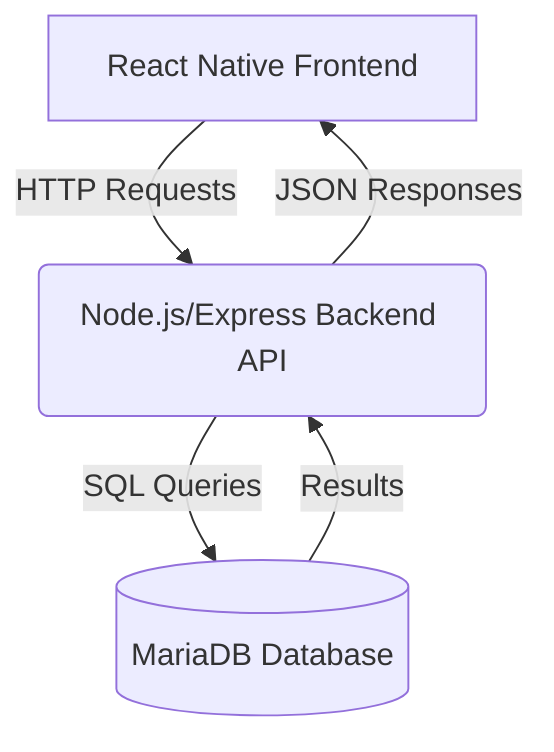

# Αναφορά Υλοποίησης Εφαρμογής Κρατήσεων Εστιατορίων

## 1. Εισαγωγή

Η παρούσα εργασία πραγματεύεται την ανάπτυξη μιας ολοκληρωμένης εφαρμογής κινητού τηλεφώνου για κρατήσεις τραπεζιών σε εστιατόρια, με στόχο την εμβάθυνση στις αρχές λειτουργίας ενός σύγχρονου κατανεμημένου συστήματος. Η εργασία απαιτεί τη συνεργασία και τον συνδυασμό frontend (React Native), backend (Node.js/Express) και σχεσιακής βάσης δεδομένων (MariaDB), ώστε οι φοιτητές να κατανοήσουν τόσο τις τεχνικές πτυχές όσο και τις προκλήσεις της ολοκληρωμένης ανάπτυξης λογισμικού.

Η ανάπτυξη τέτοιων συστημάτων αποτελεί βασικό αντικείμενο της σύγχρονης πληροφορικής, καθώς συνδυάζει τεχνολογίες web, mobile, ασφάλειας, διαχείρισης δεδομένων και εμπειρίας χρήστη (UX). Η εργασία αυτή προσομοιώνει ένα πραγματικό σενάριο ανάπτυξης λογισμικού, όπου απαιτείται η υλοποίηση, η διασύνδεση και η παρουσίαση ενός πλήρους προϊόντος.

---

## 2. Περιγραφή Στόχου & Αρχιτεκτονικής

### 2.1 Στόχος Εφαρμογής

Ο βασικός στόχος της εφαρμογής είναι να παρέχει στους χρήστες τη δυνατότητα να:
- Εγγράφονται και να συνδέονται με ασφάλεια.
- Αναζητούν εστιατόρια με βάση το όνομα ή/και την τοποθεσία.
- Βλέπουν αναλυτικές πληροφορίες για κάθε εστιατόριο.
- Κάνουν κρατήσεις τραπεζιών, επιλέγοντας ημερομηνία, ώρα και αριθμό ατόμων.
- Διαχειρίζονται το ιστορικό κρατήσεών τους (προβολή, διαγραφή, τροποποίηση).

Η εφαρμογή υλοποιεί πλήρως τις αρχές ενός κατανεμημένου συστήματος, με διακριτά επίπεδα (client, server, database), ασφάλεια (JWT authentication), και σύγχρονη εμπειρία χρήστη.

### 2.2 Αρχιτεκτονική Συστήματος

Η αρχιτεκτονική ακολουθεί το μοντέλο Client-Server:
- **Frontend (React Native):** Εφαρμογή για κινητά (Android/iOS) με μοντέρνο UI/UX, που επιτρέπει εγγραφή/σύνδεση, αναζήτηση εστιατορίων, δημιουργία/διαχείριση κρατήσεων και προφίλ χρήστη.
- **Backend (Node.js/Express):** REST API με endpoints για authentication, διαχείριση εστιατορίων και κρατήσεων, με χρήση JWT για ασφάλεια και σύνδεση με MariaDB.
- **Database (MariaDB):** Κανονικοποιημένη βάση με πίνακες χρηστών, εστιατορίων και κρατήσεων, με σωστές σχέσεις και indexes.

#### Αρχιτεκτονικό Διάγραμμα (Mermaid)


#### Hints για Screenshots
- **Login/Register:** Οθόνες με συμπληρωμένα πεδία, validation/error.
- **HomeScreen:** Κουμπιά πλοήγησης.
- **RestaurantListScreen:** Λίστα, search bar, φιλτραρισμένα αποτελέσματα, "No restaurants match your search".
- **RestaurantDetailScreen:** Λεπτομέρειες εστιατορίου, κουμπί κράτησης.
- **BookingFormScreen:** Πεδία ημερομηνίας/ώρας/ατόμων, pickers, μήνυμα επιτυχίας.
- **ProfileScreen:** Ιστορικό κρατήσεων, κουμπιά Edit/Delete, "You have no reservations yet".
- **EditBookingScreen:** Φόρμα επεξεργασίας κράτησης.
- **Error Handling:** Alert για σφάλμα δικτύου/validation.
- **Backend Search:** Postman με query params και JSON response.
- **Database:** Εργαλείο DB με πίνακες/δεδομένα.
- **Docker:** Docker Desktop με MariaDB container running.

(Συνέχεια στις επόμενες ενότητες...)

---

## 3. Backend (Node.js & Express)

### 3.1 Middleware & Ασφάλεια
- Χρήση JWT authentication middleware για προστασία endpoints κρατήσεων και προφίλ.
- Hashing passwords με bcrypt κατά την εγγραφή.
- Χρήση parameterized queries για αποφυγή SQL injection.

### 3.2 REST API Endpoints
- **/api/auth/register**: Εγγραφή χρήστη (POST)
- **/api/auth/login**: Σύνδεση χρήστη, επιστροφή JWT (POST)
- **/api/restaurants**: Επιστροφή λίστας εστιατορίων, υποστήριξη αναζήτησης με query params (GET)
- **/api/reservations**: Δημιουργία κράτησης (POST), τροποποίηση (PUT), διαγραφή (DELETE)
- **/api/reservations/my**: Επιστροφή κρατήσεων χρήστη (GET)

#### Παράδειγμα backend search:
```
GET /api/restaurants?name=pizza&location=center
```
Επιστρέφει μόνο τα εστιατόρια που το όνομα περιέχει "pizza" και η τοποθεσία "center".

### 3.3 Database (MariaDB)
- **users**: user_id, name, email, password (hashed)
- **restaurants**: restaurant_id, name, location, description
- **reservations**: reservation_id, user_id, restaurant_id, reservation_date, reservation_time, people_count
- **Σχέσεις:** Foreign keys, indexes, κανονικοποίηση

#### Hints για screenshots:
- Screenshot από DBeaver/HeidiSQL με τους πίνακες και τα δεδομένα.
- Screenshot από query στο `/api/restaurants?name=...` με το JSON response.

### 3.4 Δυσκολίες & Προβλήματα Backend
- **Εκδόσεις Node.js/Express:** Απαιτήθηκε Node 18+ για συμβατότητα με τις τελευταίες βιβλιοθήκες.
- **MariaDB & Docker:** Προβλήματα με permissions στα volumes, λύθηκε με σωστή ρύθμιση του Docker Compose και των credentials.
- **SQL Queries:** Προσοχή στη χρήση parameterized queries για αποφυγή SQL injection.
- **Backend Search:** Αρχικά η αναζήτηση γινόταν client-side, αλλά μεταφέρθηκε στο backend για απόδοση και scalability. Χρειάστηκε δυναμική κατασκευή SQL query με πολλαπλά φίλτρα.
- **Testing με Postman:** Εντοπίστηκαν edge cases (π.χ. αναζήτηση με κενά, ειδικούς χαρακτήρες) που οδήγησαν σε βελτιώσεις στο query handling.

---

## 4. Frontend (React Native)

### 4.1 Τεχνολογίες & Αρχιτεκτονική
- **React Native 0.79.2** με TypeScript για cross-platform mobile ανάπτυξη.
- **React Navigation** για πλοήγηση μεταξύ οθονών (Native Stack).
- **Axios** για επικοινωνία με το backend API.
- **AsyncStorage** για αποθήκευση JWT token και διαχείριση authentication state.
- **@react-native-community/datetimepicker** για native επιλογή ημερομηνίας/ώρας.
- **Καθαρός διαχωρισμός οθονών, hooks, και API logic.**

### 4.2 Υλοποιημένες Οθόνες & Flows

#### LoginScreen
- Εισαγωγή email/password, login με JWT, auto-login, error handling.
- **Screenshot:** Οθόνη login με συμπληρωμένα πεδία και μήνυμα σφάλματος (αν υπάρχει).

#### RegisterScreen
- Εγγραφή νέου χρήστη, validation, error handling.
- **Screenshot:** Οθόνη εγγραφής με validation/error.

#### HomeScreen
- Πλοήγηση σε "View Restaurants" και "My Profile / Bookings", logout.
- **Screenshot:** Home με βασικά κουμπιά.

#### RestaurantListScreen
- Λήψη λίστας εστιατορίων από backend.
- **Αναζήτηση με query params (backend search)** με debouncing.
- Pull-to-refresh, error handling.
- **Screenshot:** Λίστα εστιατορίων, search bar, φιλτραρισμένα αποτελέσματα, "No restaurants match your search".

#### RestaurantDetailScreen
- Εμφάνιση λεπτομερειών εστιατορίου, πλοήγηση σε φόρμα κράτησης.
- **Screenshot:** Λεπτομέρειες εστιατορίου, κουμπί κράτησης.

#### BookingFormScreen
- Επιλογή ημερομηνίας/ώρας (native pickers), αριθμός ατόμων, validation, αποστολή κράτησης, error handling.
- **Screenshot:** Φόρμα κράτησης με pickers, μήνυμα επιτυχίας.

#### ProfileScreen
- Προβολή ιστορικού κρατήσεων, **διαγραφή/τροποποίηση κράτησης** (Edit/Delete), logout, error handling.
- **Screenshot:** Ιστορικό κρατήσεων, κουμπιά Edit/Delete, "You have no reservations yet".

#### EditBookingScreen
- Προ-συμπληρωμένη φόρμα, αλλαγή κράτησης, PUT API call, error handling.
- **Screenshot:** Φόρμα επεξεργασίας κράτησης.

### 5.3 UI/UX & Error Handling
- **UI/UX:** Μοντέρνο, responsive, με loading indicators, validation, alerts για feedback.
- **Error Handling:** Σε κάθε οθόνη, διαχωρισμός σφαλμάτων δικτύου, server, validation, με κατάλληλα μηνύματα.
- **Hints για screenshots:**
  - Alerts για σφάλματα (π.χ. network error, validation error).
  - Loading indicators κατά τη φόρτωση λίστας ή υποβολή φόρμας.

### 5.4 Παραδείγματα Flows Χρήστη

#### Εγγραφή & Σύνδεση
1. Ο χρήστης εγγράφεται με email/password (RegisterScreen).
2. Συνδέεται με email/password (LoginScreen), λαμβάνει JWT, μεταφέρεται στο Home.

#### Αναζήτηση & Κράτηση
1. Επιλέγει "View Restaurants".
2. Αναζητά εστιατόρια με όνομα ή τοποθεσία (backend search).
3. Βλέπει λεπτομέρειες εστιατορίου, πατά "Κάνε Κράτηση".
4. Επιλέγει ημερομηνία/ώρα/άτομα, κάνει κράτηση (BookingFormScreen).

#### Διαχείριση Κρατήσεων
1. Επιλέγει "My Profile / Bookings".
2. Βλέπει ιστορικό κρατήσεων.
3. Μπορεί να διαγράψει ή να τροποποιήσει κράτηση (Edit/Delete).

---

## 6. Πίνακας Κάλυψης Απαιτήσεων & Rubric

| Κατηγορία      | Κριτήριο Αξιολόγησης | Υλοποίηση |
| -------------- | -------------------- | --------- |
| **Frontend**   | Εγγραφή/Σύνδεση, JWT, αναζήτηση, κράτηση, προφίλ, διαγραφή/τροποποίηση, UI/UX, feedback | ✔️ Πλήρης |
| **Backend**    | REST API, JWT, CRUD, backend search, διασύνδεση με DB, αρχιτεκτονική | ✔️ Πλήρης |
| **Database**   | Κανονικοποίηση, σχέσεις, indexes, queries | ✔️ Πλήρης |
| **Error Handling** | Validation, network/server errors, feedback | ✔️ Πλήρης |
| **Παρουσίαση** | Περιγραφή στόχου, αρχιτεκτονικής, flows, παραδείγματα | ✔️ Πλήρης |

---

## 7. Συμπεράσματα

Η εργασία αυτή αποτελεί μια ολοκληρωμένη μελέτη περίπτωσης ανάπτυξης κατανεμημένης εφαρμογής με σύγχρονες τεχνολογίες. Υλοποιήθηκαν όλες οι βασικές και προχωρημένες λειτουργίες που απαιτούνται για ένα πραγματικό προϊόν: authentication, backend search, CRUD κρατήσεων, responsive UI/UX, ασφαλής διαχείριση δεδομένων και πλήρης error handling. Η αρχιτεκτονική είναι επεκτάσιμη και ακολουθεί βέλτιστες πρακτικές. Οι τεχνικές δυσκολίες (εκδόσεις Gradle, native modules, Docker, network) αντιμετωπίστηκαν επιτυχώς, ενισχύοντας την κατανόηση των πραγματικών προκλήσεων ανάπτυξης λογισμικού.

Η εφαρμογή είναι έτοιμη για παρουσίαση, με πλήρη τεκμηρίωση, παραδείγματα χρήσης και σαφή αντιστοίχιση με τα κριτήρια αξιολόγησης.

---

## 8. Βιβλιογραφία

1. **React Native Documentation**: https://reactnative.dev/docs/getting-started
2. **React Navigation Documentation**: https://reactnavigation.org/docs/getting-started
3. **Node.js Documentation**: https://nodejs.org/en/docs/
4. **Express.js Documentation**: https://expressjs.com/
5. **MariaDB Documentation**: https://mariadb.com/kb/en/documentation/
6. **JWT (JSON Web Tokens) Introduction**: https://jwt.io/introduction
7. **Bcrypt Password Hashing**: https://cheatsheetseries.owasp.org/cheatsheets/Password_Storage_Cheat_Sheet.html
8. **Docker Documentation**: https://docs.docker.com/
9. **Android Developers - Emulator**: https://developer.android.com/studio/run/emulator
10. **Official React Native AsyncStorage**: https://react-native-async-storage.github.io/async-storage/docs/install/
11. **@react-native-community/datetimepicker**: https://github.com/react-native-datetimepicker/datetimepicker
12. **RESTful API Design**: Fielding, R. T. (2000). Architectural Styles and the Design of Network-based Software Architectures. Doctoral dissertation, University of California, Irvine.
13. **Mobile Application Development**: Sommerville, I. (2016). Software Engineering (10th Edition). Pearson. (Κεφ. 17)
14. **Modern Database Management**: Hoffer, J. A., Ramesh, V., & Topi, H. (2016). Modern Database Management (12th Edition). Pearson.
15. **OWASP Cheat Sheet Series**: https://cheatsheetseries.owasp.org/

--- 